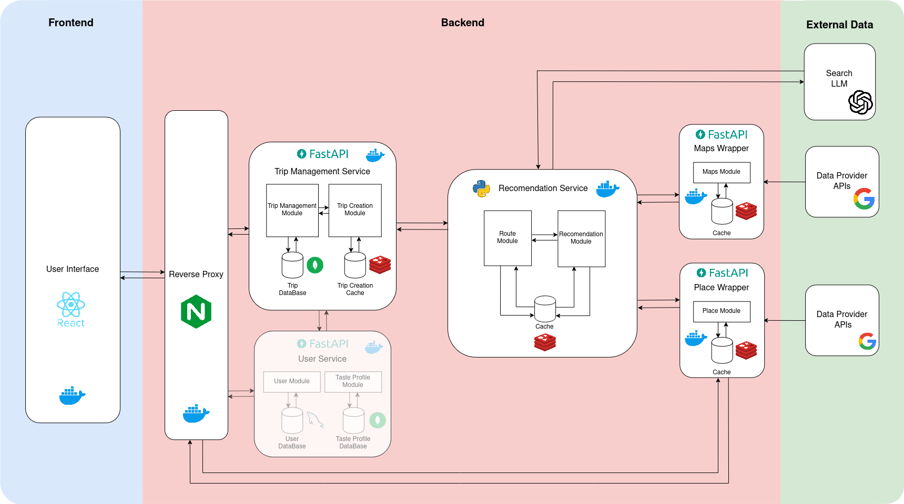

- [Deployed Site](http://www.voyage-pi.com)
- [Presentation](https://drive.google.com/file/d/14MX6Hoafjy8z51XecVFRdiTjOh3L54tn/view?usp=drive_link)

## 🧩 Problem Statement

### Lack of Local Knowledge
Travelers often find it difficult to plan personalized trips due to unfamiliarity with local options.

### Overwhelming Choices
The sheer volume of online content creates decision fatigue and impairs efficient planning.

## 🧑‍💻 Use Case
This milestone main use case was to enable a guest user as a single individual person to create a a trip type of "Place", which, allows the user to choose a certain location to travel or visit for a days interval, with still an itinerary related to a set of preferences filled by the user.

## 🏛️ Architecture

## 🧭 Workflow 

### 1. Trip Initialization
- **User Action**: Clicks `"Create Trip"` on the landing page.
- **System Response**: Displays trip type selection options.
- **User Action**: Selects `"Individual Trip"` → Chooses `"Place"` type via UI card.
- **Outcome**: User is redirected to the location selection interface.

---

### 2. Location Search & Selection
- **User Action**: Enters a location keyword into the search input field.
- **System Response**:
  - Triggers autocomplete (via Places Wrappers -> Google Places API).
  - Returns a list of location suggestions in real time.
- **User Action**: Selects a suggested location.
- **System Response**:
  - Centers the map on the selected location.
  - Places a visual marker on the map to indicate it.

---

### 3. Trip Date Selection
- **User Action**: Inputs desired trip duration using two date pickers (`start_date` and `end_date`).
- **Outcome**: Stores the selected date range in trip context/session.

---

### 4. Preferences Questionnaire
- **User Action**: Completes a form with a series of trip-related questions.
- **UI/UX Design**:
  - Inputs use Likert scales (1–7 range).
  - Covers topics such as activity type, pace, interests, group dynamics.
- **System Response**:
  - Captures user preferences.
  - Translates answers into structured parameters for itinerary generation (categories, scores).

---

### 5. Itinerary Generation
- **System Action**:
  - Aggregates all collected input data: destination, dates, preferences.
  - Queries relevant services (e.g., recommendation engine, route planner).
- **System Output**:
  - Returns a dynamically generated itinerary.
  - Includes ordered list of locations, suggested activities/locations, and routes.
- **User View**:
  - Visual itinerary preview.
  - Map with highlighted stops and routing paths.

## 🛠️ Construction Phase 

### 1. **Development Setup**
- CI/CD pipelines
- Service setup
- Multi-service dev environment (orchestrator model)

### 2. **Feature Implementation**
- Data collectors
  - Maps Wrapper
  - Places Wrapper
- Recommendation system & UI
- Route system & UI 
- Trip creation backend & frontend

### 3. **APIs & External Services**
- Google API integration
  - Google Places API (new)
  - Google Routes API 
  - Google Maps API
- LLM integration for activity scheduling

## 🧠 Road Blocks & Learnt Stuff 
- Deployment & environment configuration
- Managing modular services
- Integrating external APIs effectively

