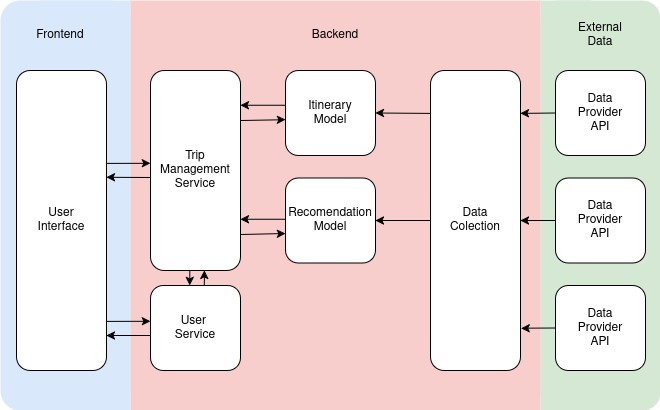

### Useful Links:

- [Project Specification](https://drive.google.com/file/d/1nK7XlZAsDgLFSjN2aXheFGKaIJo35WSg/view?usp=sharing)
- [Presentation](https://drive.google.com/file/d/1lBI_FNm6EyifWQNjonMYfSIt_BlSgYmB/view?usp=sharing)

### Problem

Travelers often struggle to plan personalized trips due to a lack of local knowledge, an overwhelming number of choices, and the challenge of finding and planing activities aligned with their preferences and time frames.

- Planning an itinerary requires gathering details from multiple sources, making it hard to create a good travel plan;
- Travel plans often don’t take into account external factors like weather, transportation and overall logistics leading to poor experiences;
- The vast number of online options leads to decision fatigue, making it difficult to select activities that best align with the user’s vision;

### Related Work

| Service | [Layla AI](https://layla.ai/?utm_medium=tripplanner) | [Wonderplan](https://wonderplan.ai/) | [Mindtrip](https://mindtrip.ai) | Voyage |
| --- | --- | --- | --- | --- |
| Budgeting | ✅ | ✅ | ✅ | ✅ |
| Trip planning | ❌ | ✅ | ✅ | ✅ |
| Zone Setting | ❌ | ❌ | ✅ | ✅ |
| Group Features | ❌ | ❌ | ✅ | ✅ |
| Reusable preferences Profile | ❌ | ❌ | ❌ | ✅ |

### Main Features

- Personal travel history
- Tailored recommendations
- Itinerary creation
- Simplified trip budgeting

### Goals & Expected results

- Provide personally tailored activity recommendations;
- Incorporate factors like weather forecasts, local events, and seasonal trends in order to improve the itinerary’s quality;
- Smooth and straightforward user interaction
- Simplified trip budgeting
- Reduce research and planning time

### High-level Architecture

