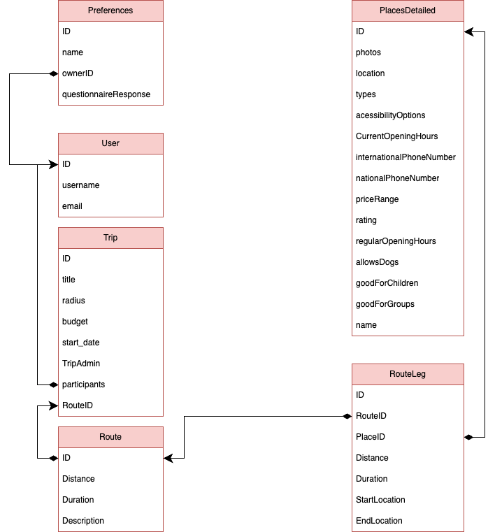

### Useful Links:

- [Presentation](https://drive.google.com/file/d/1plgbnc8DaWzjHlrfocGRSW__fq-W4DrG/view?usp=sharing)
- [Figma](https://www.figma.com/design/Pc6ESlfAh6nQbOFuENQsdX/Voyage-Website?m=auto&t=ds0AqZaAnVbpjPKD-6)

# Personas

 #1 Group Individual Preferences João Albuquerque 

- Age: **23**
- Gender: **Male**
- Occupation: **Freelance photographer**
- Interests: **Photography, Local culture, traditions and documentary photography**
- Technology Literacy: **Medium-High**
- Motivation:
    - He wants plan a group trip where he and his friends have different interests and want (cimplete)

### **Scenario**

João Albuquerque, a 23-year-old freelance photographer, is passionate about capturing the essence of local cultures and traditions. For his next adventure, he is planning a group trip with friends, but organizing it proves challenging as everyone has different interests. As the trip organizer, João needs a tool that can merge these diverse preferences into a well-balanced itinerary while still allowing him time to focus on his photography.

Using an intuitive, AI-powered platform, Voyage, João wants to begins setting up the trip by logging in and starting the creation of a trip in the application. After starting the creation process João selects Group trip and after the “Combined Group Preferences” option he continues to fill in the trip specifications. After that João sends the invite for this group trip to the friends in his friends list. With this João fills in his preference forms and his friends receive one too.

Once all responses are gathered, the AI processes the data and generates an itinerary that accommodates a variety of activities, ensuring that each person’s interests are represented fairly. The itinerary remains flexible, allowing the group to review, modify, and even vote on activities before finalizing the plan.

### **User Stories**

**1. As a photographer, I want an itinerary that includes visually stunning locations so that I can capture high-quality documentary photography.**

**Acceptance Criteria:**

- After filling the preferences forms the system suggests locations according to preferences.

**2. As a trip organizer, I want an easy way to collect my friends’ travel preferences so that I can create an itinerary that satisfies everyone.**

**Acceptance Criteria:**

- The system allows the trip organizer to add friends to a trip.
- The system allows the trip organizer to create a group trip with friends.
- The system sends preference forms to invited friends.
- The AI processes and balances different interests.
- The itinerary updates dynamically based on the group’s input.

**3. As a traveler in a diverse group, I want the itinerary to balance different types of activities so that everyone has an enjoyable experience.**

**Acceptance Criteria:**

- The system **ensures fair distribution** of activities among different interest groups.

**4. As a medium-high tech user, I want an intuitive and adaptive AI system that refines recommendations based on real-time feedback so that I don’t have to spend too much time adjusting the itinerary manually.**

**Acceptance Criteria:**

- After creating a trip the user must be able to edit it by removing or moving itinerary slots freely
- User can recreate the itinerary

 #2 Group Group Preferences Matilde Ferreira 

- Age: **19**
- Gender: **Female**
- Occupation: **Student**
- Interests: **Medicine, Biology, Partying**
- Technology Literacy: **Medium**
- Motivation:
    - She wants to plan a group trip with her friends were they all want to do the same thing

**Scenario:**

Matilde Ferreira is a 19-year-old student passionate about medicine and biology, but she also loves socializing and partying with her friends. She has a small group of friends that share the same interests and wants to organize a trip to Punta Cana where everyone has fun and enjoys the same beach activities.

After logging in Voyage App, she clicks on “create new trip”. In the trip creation phase, after choosing the type of trip and place to go, she picks select the group trip option. Then, she invites her friends. Additionally, she selects the singular group preferences, followed by other trip preferences.

After creating the trip, she wants to be able to make some changes with the help of her friends. Therefore, she goes to her profile to the itineraries section. There, she and her friends can make their changes. If they think that a previous itinerary version was better, they can easily access its history.

**User Stories**

**1. As a student who want the create, I want an easy way to create a group trip itinerary so that my friends and I can plan a trip.**

**Acceptance Criteria:**

- The system allows the user to create a new trip itinerary.
- The user can invite friends to collaborate on the itinerary.
- Users can add, remove, or rearrange activities easily.

**2. As a person with medium technology literacy, I want an intuitive app that allows me create group itineraries adapted to certain preferences effortlessly so that I don’t feel overwhelmed by complicated interfaces.**

**Acceptance Criteria:**

- The interface is simple and easy to navigate.
- The process of the system getting to know the group preferences should me smooth.

**3. As Matilde, I want to edit an existing itinerary so that I can make adjustments and update plans with my friends.**

**Acceptance Criteria:**

- The user can access the list of created itineraries from their profile.
- The user can select an itinerary and enter an editing mode.
- The user can add, remove, or modify activities, dates, and preferences.
- Changes are saved and updated in real-time for all group members.
- The system notifies group members when changes are made.

**4. As Matilde, I want to access the history of my itinerary so that I can revert to a previous version if needed.**

**Acceptance Criteria:**

- The user can access the itinerary history from the “Itineraries” section.
- The system displays a list of previous versions with timestamps.
- The user can preview a previous version before reverting.
- The user can restore a past version, making it the active itinerary.
- The system saves the current version before restoring an older one.

 #3 Individual  Place Miguel Pacheco 

- Age: **34**
- Gender: **Male**
- Occupation: **Lawyer**
- Interests: **Justice, Politics, Football,**
- Technology Literacy: Medium-High
- Motivation:
    - He is overwhelmed by his work and he wants to take a break from it, so he looks for a fast and simple way to plan a couple days of vacation.
    - Wants to visit specific monuments and wants to create an itinerary with them in it

### Scenario

Due to his work load in the past few days, Miguel is taking a few days off to clear his mind and spirit. He is looking for a fast way to plan a reasonable trip to Veneza, without the need of an agency, for that h’e encounters, upon searching for planning platforms, Voyage, then he proceeds to open the landing page he Logs in, after choosing to create an account, he clicks on a button to begin the process of creating a trip, between the choices available he chooses a “Place Trip” option, passing to the next phase of the creation he selects the Place, by selecting or typing a location into the search bar, then he inserts the budget that he wishes for the trip, after filling a small forms related to the intention and preferences of the trip, he is redirected to a page where he can evaluates and chooses, if he has friends added to his profile, some similar trip that his friends have done. After it, the platform suggests a final trip based on the questions and, if selected, his friends.

### User Stories

- As a person who seeks to travel alone to a certain place, i want to have a full descriptive plan of my trip so that i can take less time planning a mindless trip but with some content
    - **Acceptance Criteria**
        - The user is able to create a fully descriptive plan, around a place that he chooses
        - Optimized trip based on features like weather and transit
        - A plan that satisfies some related interests of the forms filled by the user

 #4 Individual RoadTrip-Casual Sofia Martins 

- Age: 32
- Gender: Female
- Occupation: **School Bus Driver**
- Interests: **Local Cuisine, Photography**
- Technology Literacy: Medium
- Motivation:
    - As a marketing specialist who frequently travels by car for business meetings, Sofia often finds herself with extra time between appointments or on her way back home. She would appreciate a planning solution that suggests convenient and interesting stops along her route without significantly extending her travel time. Her focus is on discovering local cuisine and capturing scenic photos to make the most of her trips.
    - Since Sofia is not familiar with the suburban areas between her usual routes, she is searching for a solution that helps her uncover hidden gems effortlessly.

### Scenario

Sofia, returning home from a business meeting by car, decides to make the most of her journey by exploring some interesting stops along the way. She accesses the platform, and after reaching the landing page, she logs in (or creates an account if necessary). On the main page, she clicks the button to create a new trip and selects the “Road-Trip” option. In the next step, she inputs her current location as the origin and home as the destination. She specifies a budget and a modest deviation range, aiming not to stray too far off her route. After submitting her preferences, she waits for the platform to generate convenient stop suggestions that include local dining spots and scenic viewpoints for quick photo opportunities.

### User Stories

- **As a frequent traveler returning from business trips, I want to find convenient and interesting stops along my route so that I can make the most of my extra time without significantly extending my journey**
    - **Acceptance Criteria**
        - The user is able to create a fully descriptive plan, following the path of the trip
        - Optimized roadtrip based on features like weather and transit
        - A plan that satisfies some related interests of the forms filled by the user
- **As a budget-conscious professional, I want to manage the range of deviation from my original route so that I can keep track of additional costs and travel time**
    - **Acceptance Criteria**
        - The places selected have to be within the selected range
        - The plan should display the difference in kilometers and estimated costs between the original path and the suggested route

 #5 Individual  Roadtrip-Purpose Raquel Silva 

- Age: 22
- Gender: Female
- Occupation: **University Student**
- Interests: **Art, Beach Volleyball, Swimming**
- Technology Literacy: High
- Motivation:
    - With the overwhelming pressure of the approaching deadline to choose her Master's degree, she wants to take a solo road trip along the Portuguese coast to relieve stress.
    - She needs a budget-friendly travel plan that aligns with her interests in
    - She wants an app that quickly generates a personalized itinerary with stops at relevant places along the coast.

## Scenario

Raquel Silva is a **22-year-old university student** who is struggling to decide on her Master's degree as the deadline approaches. The stress of this decision is becoming overwhelming, so she wants to **take a solo road trip along the Portuguese coast** to clear her mind.

She then enters the website, chooses to create an account and login. She then starts a new trip, and when faced with the three different types of trips offered, she clicks the roadtrip option.  At this point she will select when and where her RoadTrip starts and ends, fill in her preferences profile and choose her bugdet.

## User Stories:

**As a solo traveler,**

**I want the app to generate a personalized coastal itinerary so that I can explore locations that match my interests without extensive research.**

**Acceptance Criteria:**

- The system allows the user to input travel dates and interests.
- The app generates an optimized coastal route with suggested stops.
- Each stop includes descriptions, costs, and recommendations.
- The user can customize the itinerary by adding or removing stops.

**As a budget-conscious student, I want the app to suggest the most affordable options for transportation, accommodation, and activities so that I can stay within my budget.**

**Acceptance Criteria:**

- The user can input a maximum budget.
- The system recommends low-cost transportation options (e.g., buses, trains).
- Affordable accommodations such as hostels and budget hotels are suggested.
- Activity suggestions prioritize free or low-cost experiences.

 #6 Individual  Zone Setting Ricardo Pacheco 

- Age: 27
- Gender: Male
- Occupation: **Sales Executive**
- Interests: **Books, Ancient History, Climbing**
- Technology Literacy: High
- Motivation:
    - Ricardo is on a short business trip in a city he is unfamiliar with. His meeting ends earlier than expected, leaving him with **5 hours before his train departs**. Instead of waiting idly at the station, he wants to **explore the city without going too far from his departure point**.

Scenario

Ricardo Leal, a **27-year-old Sales Executive**, is on a short business trip in a city he is unfamiliar with. His meeting ends earlier than expected, leaving him with **5 hours before his train departs**. Instead of waiting idly at the station, he wants to **explore the city without going too far from his departure point**.

Ricardo will open the Voyage App and enter as a guest. Since he entered without an account he can only select the button to create a solo trip. He then selects the Zone trip option and using the interactive map selects the center as well as the radius he wants. He then proceeds to fill in his preference profile and gets an itinerary generated for him.

User Stories:

**As a traveler with limited time, I want to:**

1. **Define an exploration zone** by setting a radius , so that I can explore within a manageable distance.
    1. Define a radius in the map
2. **Receive activity suggestions** tailored to my interests, so that I can make the most of my available time.
    1. Make the recommendations be within bounds
3. **Ensure that my itinerary aligns with my schedule**, so that I don’t risk missing my departure.
    1. Define a start and finish time
    2. Take into account the time certain attractions may take

 #7 Individual  Friend Recommendation Sara Mendes 

- Age: 25
- Gender: Female
- Occupation: **Waitress**
- Interests: **Museums, Animals, Theater**
- Technology Literacy: Medium
- Motivation:
    - Sara being an indecisive person, she has some difficult time searching for places to visit on her free time or vacations, therefore she looks for similar trips that her friends have done.
    - Want to visit the same place as a friend because of his positive feedback of a trip he did and i wanna do the same

### **Scenario**

Sara Mendes is a **25-year-old waitress** who enjoys museums, animals, and theater, but she finds it difficult to choose destinations for her trips. Instead of browsing endless lists of recommendations, she prefers to **visit places her friends have already been to and highly rated**. She wants an app that suggests trips based on her friends’ past experiences, allowing her to **filter recommendations** based on similarities to her own interests. Since she has **medium technology literacy**, she needs a simple and intuitive interface that helps her discover **friend-based travel recommendations** without much effort.

### User Stories

**1. As an indecisive traveler, I want to see trips my friends have taken so that I can choose a destination more easily. (I’m going to be fully honest, I don’t think we should promise this; This is something we can do with a feed (which we said we weren’t going to do) or with the pinned fav trips in a user profile (which i think is better))**

**Acceptance Criteria:**

- The system suggests destinations based on **friends’ past trips**.
- Users can view **friends’ ratings, reviews, and experiences**.
- The interface is **simple** and requires minimal input from Sara.

**Acceptance Criteria 2:**

- As a User I go to my friend’s list and select a profile
- In the profile of a friend i can see their favorite trips using the app
- Clicking it I can tell the app that i would also like to do this trip myself

**2. As someone who enjoys social validation, I want to filter friend-based recommendations by similarity to my interests so that I only see relevant suggestions. (Didn’t like this User Story)**

**Acceptance Criteria:**

- Users can apply filters based on **trip type (e.g., cultural, nature, entertainment, etc.)**.
- The AI recommends trips where the **friend’s preferences overlap with Sara’s interests**.
- The system provides a **match percentage** (e.g., “This trip matches 85% of your interests”). (Very nice idea)

**3. As a person with medium technology literacy, I want an easy way to save and compare trips so that I can make a decision later. (Can improve User Story but i think the core is nice)**

**Acceptance Criteria:**

- The system allows **saving** trips.
- Users can **compare multiple trips** side by side.
- The app provides **a simple summary of each trip**, highlighting key experiences.

 #7 Admin Content Management Bruno Almeida 

- Age: 38
- Gender: Male
- Occupation: **Online Business Manager**
- Interests: **Movies, Motorized Sports, PaddleEnrique**
- Technology Literacy: Very High
- Motivation:
    - Bruno being the manager of online platforms he expects that the information, and the elements of a recommendations system, or content systems are accurate and truthful, therefore he looks for facilitated management functionalities in the platforms that he operates on.

 #8 Admin Communication  Catarina Pinheiro 

- Age: 34
- Gender: Male
- Occupation: **Remote HR Manager**
- Interests: **Classic Music, Flora Enthusiast**
- Technology Literacy: Very High
- Motivation:
    - Catarina being a person that deals with people on the daily basis she is looking for a new freelance job on an online platform. She looks for a platform that enables her to talk smoothly with the users of the platform, as well as enabling her to manage the user permissions to prevent harmful actions or to simply have a more thorough control over them.

 #9 Admin Statistic Analysis  Leandro Guimarães 

- Age: 52
- Gender: Male
- Occupation: **Data Science Specialist, AI Monitoring Specialist**
- Interests: **Puzzles, Triathlon**
- Technology Literacy: Very High
- Motivation:
    - Leandro is searching for a more light work since he already has his PPR done. On his previous companies he worked on platforms that enable him to asses the performance of the recommendations agents and content requisition and what is the targeted public. As well as the tendencies of visited and generated places by the platform, this is important for him to have a complete notion of what can be improved on the platform.

 

  

# Use case Diagram

Diagram of the use cases for the Voyage platform

# Create Trip Flow

Diagram of the flow of creating a trip in the Voyage platform

# Class Diagram

Diagram of the main classes in the Voyage platform - Represents the Data Domain

# Functional Requirements

- Personalized Trip Management
  - Create and manage individual or group trips with preferences.
  - Edit trips and manage group members
  - View past trip history
- User Profiles & Social Features
  - Share profiles, manage friend requests & update privacy settings.
  - View friend's travel stats.
- Place Management
  - Save facorite places.
  - Admins can remove invalid places.

# Non-Functional Requirements
- Performance
  - 90% of pages should return results in under 3 seconds
  - Search results should be displayed within 3 seconds
  - Personalized recommendations should be generated within 8 seconds
  - Itinerary updates and refreshes should be processed within 3 seconds

- Usability
  - 70% of users should be able to complete their desired tasks successfully on the first attempt
  - Users should be able to learn and navigate the system comfortably within 15 minutes of first use
  - Users should be able to create and modify a trip within 3 minutes on average.

# Architecture

# Preferences Questionnaire

The preferences questionnaire is a set of questions that the user answers to help the AI generate a personalized itinerary.

Preferences Questionnaire

- How interested are you in experiencing local culture on this trip?
 (e.g., museums, historical sites, art galleries, cultural performances)

- How much do you want to include outdoor activities during this trip?
 (e.g., hiking, biking, exploring nature parks)

- What type of experience are you looking for on this trip?

  - Mostly relaxing (beach resorts, spas, slow-paced activities)
  - Mostly adventurous (exploring, extreme sports, active experiences)
  - A mix of both
- How important is food in your travel experience for this trip?
 (e.g., trying local cuisine, street food, fine dining, food tours)

- Are you looking to meet new people during this trip?
 (e.g., group tours, social events, nightlife, staying in hostels)

- Do you plan to do any shopping during your trip? (e.g., markets, boutiques, souvenirs)

- Would you rather visit popular tourist landmarks or explore hidden, off-the-beaten-path places on this trip?

- For this trip, are you more interested in exploring cities or nature-filled destinations?

- Are you okay with visiting places during peak tourist times, or would you prefer quieter, less crowded experiences?

- Do you plan to experience the nightlife during this trip? (e.g., bars, clubs, live music, cultural night events)

- Will you be comfortable using public transportation at your destination? (e.g., buses, trains, subways)

- Would you prefer to explore your destination mostly on foot, or will you rely on transportation to get around?

# Mockup (demo)
[Mockup](https://drive.google.com/file/d/15SS8WiA-dhiUL8yBCIakwMj5Pq5gxnH4/view?usp=sharing)
[Figma](https://www.figma.com/design/Pc6ESlfAh6nQbOFuENQsdX/Voyage-Website?m=auto&t=ds0AqZaAnVbpjPKD-6)

# State of the Art (draft)

[State of the Art](https://docs.google.com/document/d/1cUOr5KdirTv1Zb9bfRAtHXTnKvO5XbwWiUXL-FxHrfI/edit?usp=sharing)
