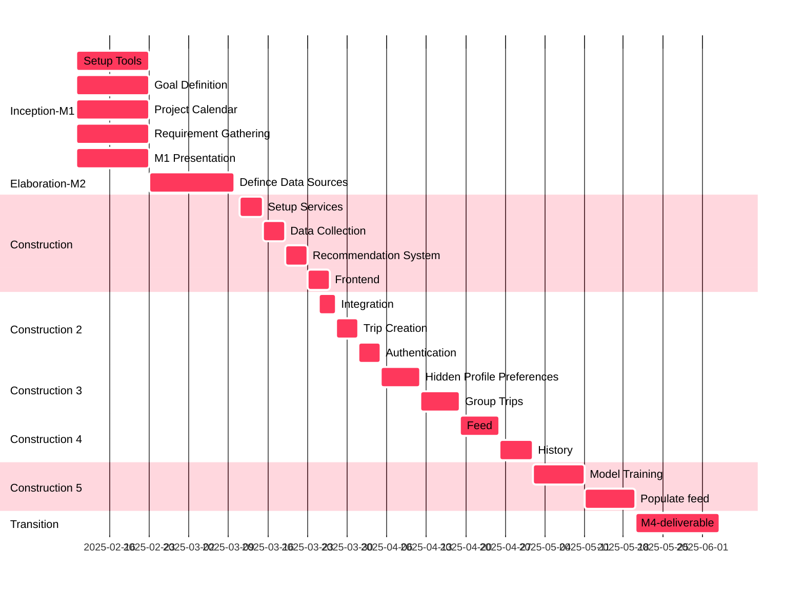

```mermaid
%%{
  init: {
    'theme': 'base',
    'themeVariables': {
      'primaryColor': '#fe385c',
      'primaryTextColor': '#000',
      'primaryBorderColor': '#FFF',
      'tertiaryColor': '#fff'
    }
  }
}%%
gantt
    todayMarker stroke-width:0px,stroke:#000,opacity:0.2,z-index:-10
    dateFormat  YYYY-MM-DD
    section Inception-M1
    Setup Tools:a1, 2025-02-10, 13d
    Goal Definition:a2,2025-02-10,13d
    Project Calendar:a3,2025-02-10,13d
    Requirement Gathering:a4,2025-02-10,13d
    M1 Presentation: a5,2025-02-10,13d
    section Elaboration-M2
    Defince Data Sources :ds1, after a5, 15d
    section Construction
    Setup Services :c1, 2025-03-11, 4d
    Data Collection:c2, after c1, 4d
    Recommendation System:c3,after c2,4d
    Frontend:c4,after c3, 4d
    section Construction 2
    Integration: cc1, 2025-03-25,3d
    Trip Creation:cc2,after cc1,4d
    Authentication:cc3,after cc2,4d
    section Construction 3
    Hidden Profile Preferences:ccc1,after cc3,7d
    Group Trips: ccc2, after ccc1,7d
    section Construction 4
    Feed : p1,after ccc2,7d
    History:p2,after p1,6d
    section Construction 5
    Model Training: j1,after p2,9d
    Populate feed:j2,after j1,9d
    section Transition
    M4-deliverable : 2025-05-20,15d

```